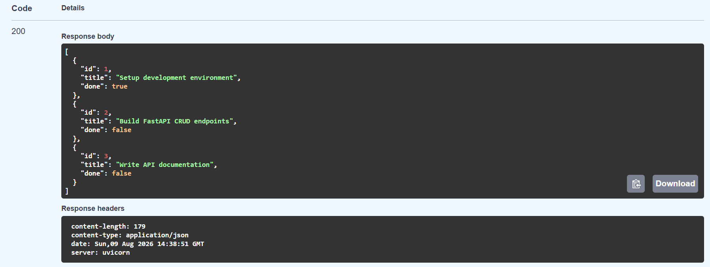
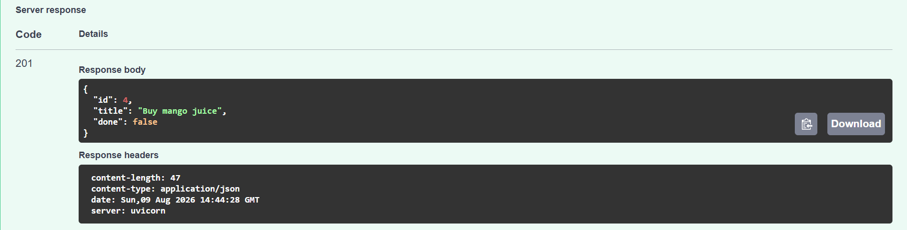
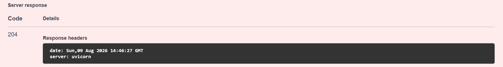

# Task Management CRUD API

A lightweight, high-performance API for managing a to-do list, built with **FastAPI** and **Pydantic**. 

---

## What This Is

This project is an in-memory task management backend service created as part of the FlyRank Backend Internship (Week 2). It simulates a complete backend service for managing to-do items—allowing clients to create new tasks, view existing tasks, update task details, and delete tasks. 

The primary goals of this project are to:
- Practice handling standard HTTP methods (`GET`, `POST`, `PUT`, `DELETE`).
- Implement proper input validation to ensure empty or malformed data is rejected.
- Enforce standard HTTP status codes (`200`, `201`, `204`, `400`, `404`) to give clear feedback to clients[cite: 2].
- Provide self-documenting interactive API testing via Swagger UI.

## How to Install & Run

### 1. Installation
Clone the repository, set up a virtual environment, and install dependencies:

```bash
# Clone the repository
git clone [https://github.com/shathahsaleem/task-api.git](https://github.com/shathahsaleem/task-api.git)
cd task-api

# Create and activate a virtual environment
python -m venv venv

# On Windows (PowerShell):
.\venv\Scripts\Activate.ps1
# On macOS/Linux:
source venv/bin/activate

# Install required dependencies
pip install fastapi uvicorn pydantic
```

### 2. Activation
Run the server by starting the Uvicorn development server:
```bash
uvicorn main:app --reload
```
The API will be running live at http://localhost:8000. You can access the interactive Swagger UI documentation directly at http://localhost:8000/docs.

## API Endpoints Overview

| Method | Endpoint | Description | Request Body | Success Status | Error Statuses |
| :--- | :--- | :--- | :--- | :--- | :--- |
| `GET` | `/` | API metadata and available endpoints | None | `200 OK` | N/A |
| `GET` | `/health` | Health check endpoint | None | `200 OK` | N/A |
| `GET` | `/tasks` | Retrieve all tasks | None | `200 OK` | N/A |
| `GET` | `/tasks/{task_id}` | Retrieve a single task by ID | None | `200 OK` | `404 Not Found` |
| `POST` | `/tasks` | Create a new task | `{"title": "Buy milk"}` | `201 Created` | `400 Bad Request`, `422 Unprocessable` |
| `PUT` | `/tasks/{task_id}` | Update task title and/or completed status | `{"title": "Updated", "done": true}` | `200 OK` | `400 Bad Request`, `404 Not Found` |
| `DELETE` | `/tasks/{task_id}` | Delete a task by ID | None | `204 No Content` | `404 Not Found` |

## Sample `curl -i` Execution Output

Below is the raw HTTP response output from creating a new task using `curl -i`:
```text
HTTP/1.1 201 Created
date: Sun, 09 Aug 2026 14:31:23 GMT
server: uvicorn
content-length: 57
content-type: application/json

{"id":4,"title":"Prepare team presentation","done":false}
```

## Interactive Documentation (Swagger UI)

FastAPI automatically generates interactive documentation accessible directly in your browser at:
**`http://localhost:8000/docs`**

---

### Case 1: Read All Tasks (`GET /tasks`)
Retrieves the initial list of pre-filled tasks from memory with a `200 OK` status.



---

### Case 2: Create Task (`POST /tasks`)
Sends a JSON request body `{"title": "Buy mango juice"}` to create a new task, returning a `201 Created` status and assigning a unique ID.



---

### Case 3: Delete Task (`DELETE /tasks/{task_id}`)
Deletes task #4 by ID, returning a `204 No Content` status confirming successful removal.

